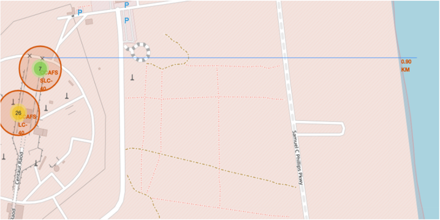

# SpaceX Falcon9 First Stage Landing Prediction : Project Overview

The commercial space age is here, companies are making space travel affordable for everyone. Perhaps the most successful is SpaceX. One reason SpaceX can do this is the rocket launches are relatively inexpensive. SpaceX advertises Falcon 9 rocket launches on its website with a cost of 62 million dollars; other providers cost upward of 165 million dollars each, much of the savings is because SpaceX can reuse the first stage. Therefore if we can determine if the first stage will land, we can determine the cost of a launch. This information can be used if an alternate company wants to bid against SpaceX for a rocket launch.
In this project, we will predict if the Falcon 9 first stage will land successfully and we will collect and make sure the data is in the correct format and then we will start working with it.

## The workflow of this project

* Collecting a dataset to work with using two methodologies (Wikipedia Web scraping and data collection using SpaceX public API).
* Data wrangling and preprocessing to make it suitable and prepared for machine learning modeling and prediction.
* Applying EDA to our collected data to try to get insights from it using SQL (SQLITE3 & IBM DB2) and data visualization tools (matplotlib, seaborn & folium).
* Creating a web-based interactive dashboard to help stakeholders understand more the data using dash framework and plotly
* Training some classification models (Logistic Regression, SVM, KNN & Decision Tree Classfier) on the data we have to be able to predict whether first stage of Falcon9 rocket will land successfully on the upcoming launches or not.

## Code and Resources used

<b>Python Version: </b>3.9 
<b>Packages: </b>pandas, numpy, matplotlib, seaborn, scikit-learn, BeautifulSoup, requests, datetime, folium, ipython-sql, sqlalchemy, sqlite3, ibm_db, dash, plotly 
<b>For Web Framework Requirements: </b><code>pip install -r requirements.txt</code>

## Web Scraping

scraped 121 SpaceX flights of Falcon9 rockets from 'wikipedia.org'. With each flight we get these variables :
* Flight Number
* Launch Site
* Name of distributer of each rocket's payload (The portion of a spacecraft that is responsible for achieving the mission's primary objectives)
* Payload mass
* Type of orbit each rocket will follow
* Customer
* Launch Outcome
* Booster Version
* Booster landing Outcome
* Launch date
* Launch time

## Data Collection using SpaceX public API

scraped 90 SpaceX flights of Falcon9 rockets from 'api.spacexdata.com'. With each flight we get these variables :
* Flight Number
* Date of Launch
* Booster Version
* Payload mass
* Type of orbit each rocket will follow
* Launch Site
* Flight Outcome
* Number of flights with this core
* Whether gridfins were used
* Whether the core is reused
* Whether legs were used
* Landing Pad
* Block of the core
* Number of times this core has been reused
* Serial of the core
* Longitude of Launch Site
* Latitude of Launch Site

## Data Cleaning & Wrangling

After scraping data out from wikipedia and SpaceX public API, we had to clean it up and prepare it for data modeling, and to for that I made the following updates on it :
* Filtered our collected data to only contain Falcon9 launches.
* Dealt with missing values within Payload mass feature and filled it out with the mean of non-missing payload mass values.
* Created the dependent variable (target) naming it "Class" which will be a binary variable (0 for a failed landing first stage & 1 for a successfully landing first stage) using Flight Outcome variable.
* Created dummy variables from categorical features so the model could use them in the its training process.

## EDA with SQL (SQLITE3 & IBM DB2)

When finishing up the data cleaning process, we had to get insights and patterns from our data using SQL (SQLITE3 & IBM DB2) by executing some queries (10) :
* The names of the unique launch sites in the space mission
* The first 5 records where launch sites begin with the string 'CCA'
* The total payload mass carried by boosters launched by NASA (CRS)
* The average payload mass carried by booster version F9 v1.1
* The date when the first successful landing outcome in ground pad was acheived
* The names of the boosters which have success in drone ship and have payload mass greater than 4000 but less than 6000
* The total number of successful and failure mission outcomes
* The names of the booster_versions which have carried the maximum payload mass
* The records which will display the month names, failure landing_outcomes in drone ship ,booster versions, launch_site for the months in year 2015
* Ranking the count of successful landing_outcomes between the date 04-06-2010 and 20-03-2017 in descending order

## EDA with data visualization (Matplotlib, Seaborn & Folium)

I looked at the relationships and the correlation between all available features of this data that we got and below are a few highlights of the visualizations that I made :
  

